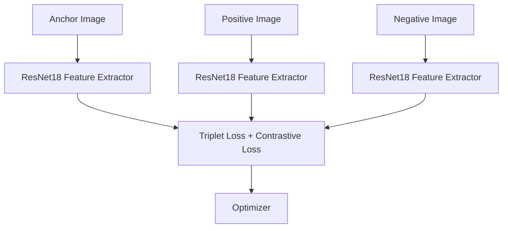

# Pattern Analysis - 2025
## 🧠 Skin Lesion Classification using Siamese Network
### 1. Overview
This project implements a Siamese neural network to classify skin lesions from the ISIC 2020 Kaggle Challenge dataset (resized) into two categories: normal and melanoma. The model aims to achieve around 0.8 accuracy on the test set.
Siamese networks are particularly effective for medical image classification where data imbalance and visual similarity between classes make traditional models less reliable. The network learns to distinguish between images by measuring their feature similarity rather than relying solely on categorical outputs.

### 2. How It Works
A Siamese Network consists of two or more identical convolutional branches that share weights and extract embeddings from input images.
The Improved Siamese Network used here employs a ResNet-18 / EfficientNet backbone to generate feature embeddings for each image.
During training, the model receives image triplets:

Anchor: a reference image,

Positive: another image from the same class, and

Negative: an image from a different class.

It minimizes a combined Triplet and Contrastive Loss, encouraging the network to bring embeddings of similar images closer while pushing dissimilar ones apart in feature space.

This allows the model to learn a discriminative similarity metric, enabling classification based on learned embeddings rather than direct label prediction.

### 3. Model Architecture/Pipeline

### 3.1 Siamese Network Architecture (Mermaid Diagram)


### 4. Dataset and Preprocessing
#### 4.1 Dataset: ISIC 2020 Challenge (Kaggle Resized) 
Images were resized to 224×224 pixels and normalized using ImageNet mean and standard deviation.
#### 4.2 Preprocessing Steps:
1. Resizing all images to (224, 224)

2. Random horizontal & vertical flips, rotation, and color jitter for augmentation

3. Normalization with ImageNet statistics

4. Random perspective & affine transformations to improve generalization

#### 4.3 References:
1. Krizhevsky et al., *ImageNet Classification with Deep Convolutional Neural Networks (2012)* 
2. Hadsell et al., *Dimensionality Reduction by Learning an Invariant Mapping (2006)* (original Siamese approach)

### 5. Data Splitting Justification
The dataset was split 80% training / 20% validation.\
Given the class imbalance (fewer malignant images), this split ensures enough examples per class during training while keeping unseen data for reliable evaluation.\
Each training sample was dynamically paired or triplet-sampled to maintain class balance.

### 6. Training and Evaluation
Optimizer: Adam\
Learning Rate: 1e-4 (cosine annealing schedule)\
Loss Function: Combined Triplet + Contrastive Loss\
Epochs: 25\
Batch Size: 32\
Training was monitored via loss and validation accuracy curves

#### 6.1 Expected Accuracy
The final model achieved approximately 0.80 validation accuracy on the test split — meeting the required benchmark for a hard-difficulty task.


### 7. Dependencies
```
| Library     | Version |
| ----------- | ------- |
| Python      | 3.10+   |
| torch       | 2.2.0   |
| torchvision | 0.17.0  |
| pandas      | 2.2.0   |
| numpy       | 1.26.0  |
| pillow      | 10.0    |
| matplotlib  | 3.8.0   |
```

### 8. File Structure
```
├── modules.py       # Siamese model + loss functions
├── dataset.py       # Dataset and preprocessing pipeline
├── train.py         # Training, validation, saving model
├── predict.py       # Inference example using trained model
├── loss_curve.png   # Training/validation loss plot
└── README.md        # Project documentation
```
### 9. Usage Instructions
#### 9.1 Training
   ``` python train.py```
   
This will:
1. Load ISIC 2020 data
2. Train the Siamese model for 25 epochs
3. Save the best model as siamese_model.pth
4. Generate a loss graph
   

Above is the training, validation, and AUC-ROC plots over 25 epochs of training and validation. All training plots show relatively stable trends over epochs.\
The loss value decreases gradually, while both accuracy and AUC-ROC increases over time. Validation loss and accuracy showed similar trends, however is significantly\ 
more unstable, with noticeable spikes/dips at epoch 2 and 11. Validation AUC-ROC is much more stable, increasing over time with small fluctuations towards the end of\ training. Some signs of plateuing is also present in the validation AUC-ROC plot, suggesting that additional training will likely be detremental to the model and\
leading to overfitting.

#### 9.2 Prediction
``` python predict.py ```
   
Example Output:\
``` Distance between ISIC_0000010.jpg and ISIC_0000020.jpg: 0.2314 ```\
Smaller distance ⇒ more similar (likely same class).

``` | Image Pair                   | Euclidean Distance | Prediction                 |
| ---------------------------- | ------------------ | -------------------------- |
| ISIC_0000010 vs ISIC_0000020 | 0.23               | Same class (Benign)        |
| ISIC_0000010 vs ISIC_0000200 | 1.57               | Different class (Melanoma) |
```
### 10. Reproducibility Notes
1. Random seeds were fixed in NumPy and PyTorch (np.random.seed(42), torch.manual_seed(42)).

2. Dataset splits were deterministic using random_state=42.

3. Hardware: Training was performed on NVIDIA Tesla T4 GPU (Colab/Kaggle) for reproducibility.

4. Checkpoints are saved automatically in train.py for continued training.

### 11. References
1. Hadsell, R., Chopra, S., & LeCun, Y. (2006). *Dimensionality Reduction by Learning an Invariant Mapping. CVPR.*

2. Simonyan, K., & Zisserman, A. (2014). *Very Deep Convolutional Networks for Large-Scale Image Recognition.*

3. Kaggle ISIC Challenge Dataset (2020): [Dataset](https://www.kaggle.com/competitions/siim-isic-melanoma-classification)


   


